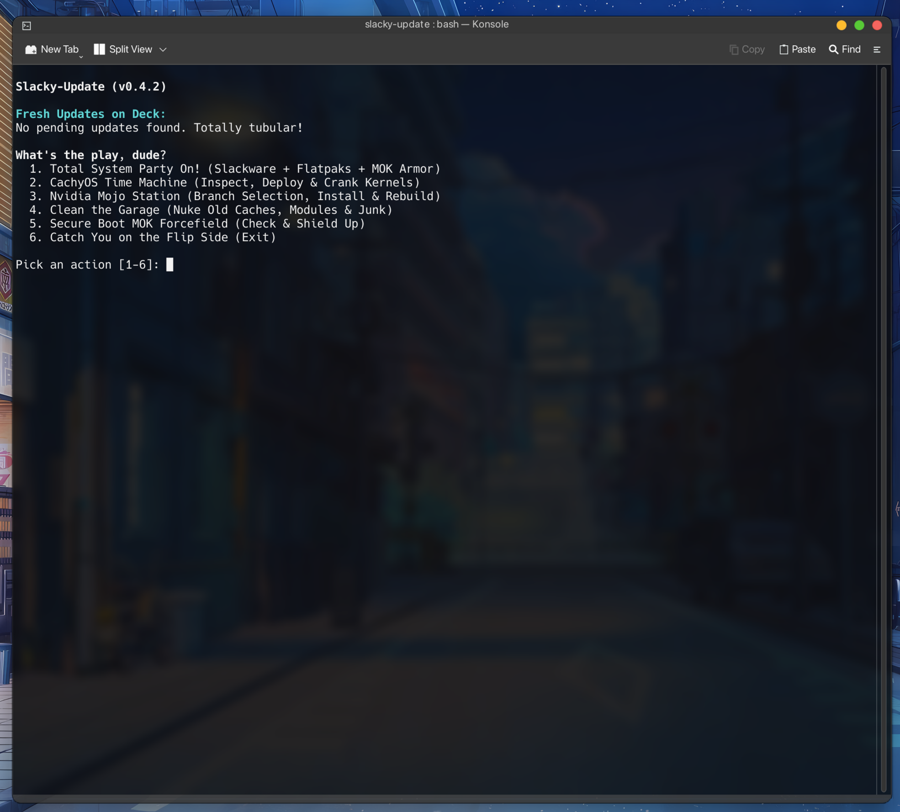
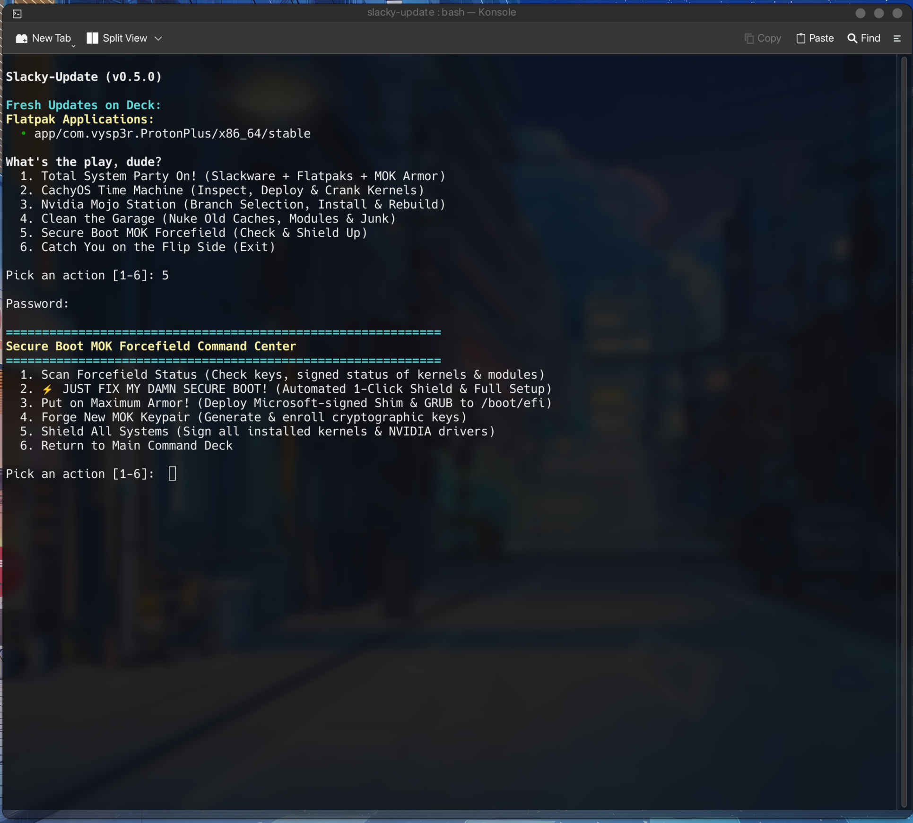
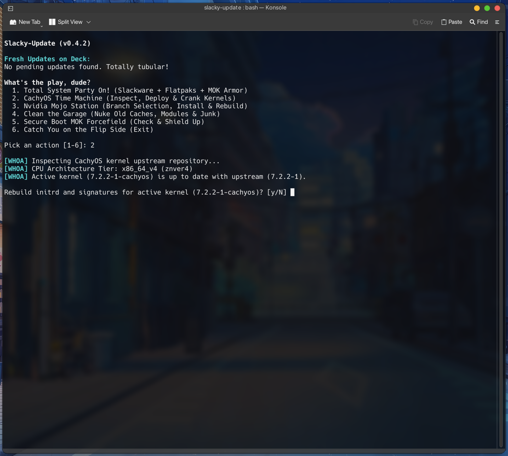
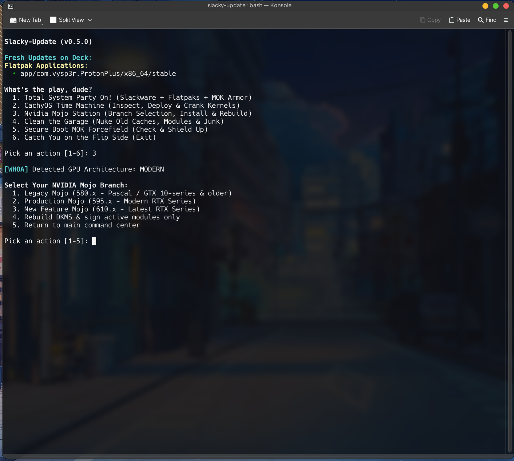
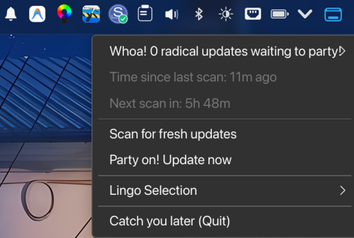
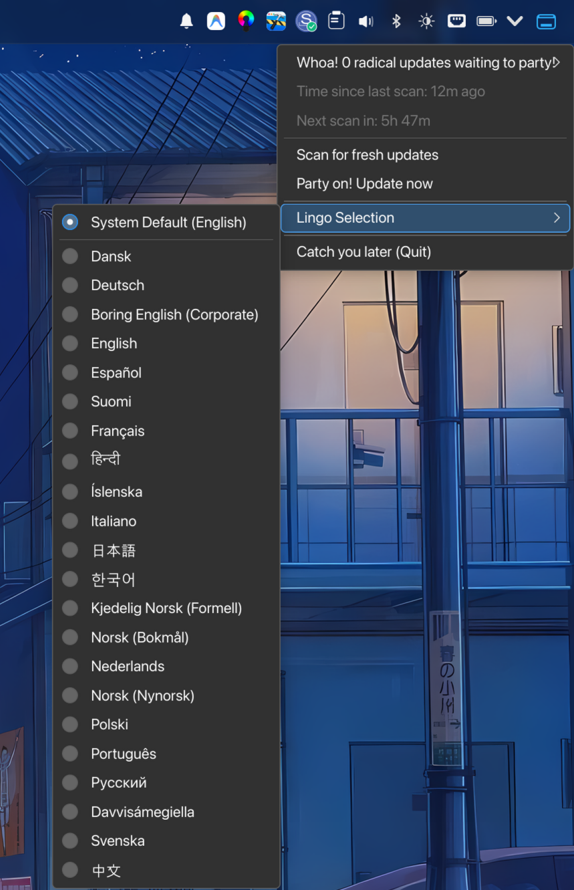

<div align="center">

# ⚡ SLACKY-UPDATE ⚡
### *The Most Tubular System Update Station, Kernel Time Machine & Driver Mojo Command Center for Slackware Linux*

[](http://www.slackware.com/)
[](LICENSE)
[](https://ko-fi.com/tuxofvalhalla)
[-yellow?style=for-the-badge)](locales/)
[](bin/)

---

### *Party on, Wayne! / Party on, Garth!*
**Slacky-Update** is an all-in-one, high-octane maintenance station and background system monitor engineered specifically for **Slackware Linux (-current / 15.0+)**. 

It bridges the gap between pure Slackware simplicity and modern powerhouse capabilities: **CachyOS Kernel Picker** (*Standard, BORE, and BORE-LTO flavors*), automated upstream **CachyOS kernel deployment** with CPU architecture optimization (*znver4 / v4*), interactive **NVIDIA driver branch selection & DKMS compilation**, automated **Dracut initramfs generation**, **1-Click Microsoft-signed UEFI Secure Boot setup**, **silent bootloader self-healing**, **Smart `.new` configuration reconciliation**, **smart reboot evaluation**, **GitHub self-updater**, **Flatpak GL runtime synchronization**, and intelligent **retention policies** for your bootloader.

*Slacky-Update is designed to keep Slackware Linux effortlessly maintained, rock-solid, and 100% ready for high-performance gaming and seamless Windows 11 dual-booting with UEFI Secure Boot permanently enabled—without requiring a PhD in UNIX sysadmin work!*

</div>

---

## 📸 Screenshots & Visual Tour

<div align="center">

### 🖥️ Interactive Terminal Command Center
*Rich ANSI color-coded menus, real-time pending update audits, and atomic one-click maintenance operations.*



---

### 🛡️ Secure Boot MOK Forcefield & 1-Click Setup
*Automated Microsoft-signed Shim & Fedora GRUB deployment, MOK key generation, DKMS & kernel signing.*



---

### 🏎️ CachyOS Time Machine & Kernel Management
*CPU microarchitecture auto-detection (znver4 / AVX-512), upstream CachyOS deployment, and dual-kernel retention.*



---

### 🎮 Nvidia Mojo Station & Branch Selection
*Instant driver branch selection (580/595/610), automated DKMS compilation, and Flatpak GL synchronization.*



---

### 🔔 System Tray Monitor & Status Applet
*Lightweight Qt5 tray icon with real-time filesystem watchers, pulsing notification animation, and quick launch triggers.*

| Tray Icon Alert | Context Action Menu | Tower of Babel Language Selector |
| :---: | :---: | :---: |
|  |  |  |

</div>

---

## 🎮 Why Slacky-Update? (Engineered for Gamers & Dual-Booters)

### 🕹️ The Ultimate Rig for Linux Gaming
Slackware is legendary for its raw speed and UNIX purity, but modern gaming demands fast-moving graphics stacks and responsive kernel scheduling. Slacky-Update supercharges your gaming battlestation:
* **CachyOS High-Performance Kernels:** Deploy upstream CachyOS kernels featuring the **BORE (Burst-Oriented Response Enhancer)** or `sched-ext` schedulers, `futex2` / `fsync` patches for Proton/Wine, and `-O3` compilation for ultra-low latency and smooth 1% low frametimes.
* **CPU Microarchitecture Optimization:** Auto-detects your exact CPU tier (*znver4 / x86_64_v4 for AMD Zen 4/5 & Intel 12th–15th+ Gen*) to unlock full AVX-512 instruction set performance.
* **Bleeding-Edge GPU Drivers:** Switch seamlessly between NVIDIA driver branches (*Production 595.x, New Feature 610.x, or Legacy 580.x*) with one click for Day-1 game support, DLSS 3/4, and latest Vulkan extensions.
* **Proton & Flatpak Synchronization:** Keeps Flatpak gaming environments (Steam, Heroic, Lutris, MangoHud) locked in perfect sync with your host graphics drivers, eliminating the dreaded OpenGL/Vulkan runtime version mismatch.

### 🪟 Seamless Windows 11 Dual-Booting (Keep Secure Boot ON!)
Windows 11 strictly mandates **UEFI Secure Boot** (and TPM 2.0) for modern security and anti-cheat systems (like Riot Vanguard / Valorant / FACEIT). Traditionally on Slackware, running custom kernels or proprietary NVIDIA drivers with Secure Boot turned on was an exercise in frustration:
* **The Dual-Boot Dilemma:** Every kernel update broke NVIDIA modules, leaving users stranded with black screens unless they went into UEFI BIOS to disable Secure Boot (which broke Windows features).
* **The Slacky-Update Fix:** With the built-in **1-Click Secure Boot Setup & MOK Forcefield**, Microsoft-signed Shim, MokManager, signed GRUB, and your Machine Owner Keys (MOK) are configured automatically.
* **Zero BIOS Toggling:** Keep UEFI Secure Boot permanently **ENABLED** in firmware. Boot back and forth between Windows 11 and Slackware Linux without ever touching BIOS settings or compromising security!

---

## 🧠 Intelligent Hardware Detection (AMD, Intel & NVIDIA)

Slacky-Update features native hardware inspection (`probe_gpu_hardware`) via PCI device querying, making it universally compatible across all GPU vendors while eliminating the historic complexity of proprietary drivers:

```
┌─────────────────────────────────────────────────────────────────────────────┐
│                      HARDWARE DETECTION & ADAPTATION                        │
├───────────────────┬─────────────────────────────────────────────────────────┤
│ AMD Radeon (RDNA) │ Native in-tree amdgpu KMS driver baked into Dracut.     │
│ & Intel Arc/Iris  │ Mesa Vulkan (RADV / ANV) runtimes synced automatically. │
├───────────────────┼─────────────────────────────────────────────────────────┤
│ NVIDIA GeForce    │ Full automated pipeline: DKMS build -> MOK signing   │
│ (RTX / GTX)       │ -> Dracut driver baking -> Flatpak GL synchronization.  │
├───────────────────┼─────────────────────────────────────────────────────────┤
│ Hybrid / Laptops  │ Dual detection (AMD/Intel iGPU + NVIDIA dGPU) with      │
│ (PRIME Offload)   │ comprehensive KMS driver inclusion for glitch-free DRM. │
└───────────────────┴─────────────────────────────────────────────────────────┘
```

* **AMD & Intel GPUs (Pure Out-of-the-Box Bliss):** For rigs running AMD Radeon (RDNA 1/2/3/4) or Intel Arc / Iris Xe graphics, Slacky-Update detects your open-source Mesa stack, automatically generates optimized Dracut images with the appropriate KMS modules (`amdgpu`, `i915`, `xe`), and manages your system with zero extra configuration.
* **NVIDIA GPUs (A Complete Cake-Walk):** What used to be a fragile multi-step nightmare on Slackware—installing .run files, compiling DKMS, generating MOK keys, signing kernel binaries, signing .ko modules, and configuring Dracut—is completely automated in a single atomic transaction.

---

## 🚀 Key Superpowers & Features

```
=============================================================================
                      ⚡ SLACKY-UPDATE COMMAND MATRIX ⚡
=============================================================================
 [1] Total System Party On!      --> Slackware Core + Flatpaks + MOK Armor
 [2] CachyOS Time Machine        --> CPU Tier Detect, Deploy & Crank Kernels
 [3] Nvidia Mojo Station         --> Branch Selection (580/595/610), DKMS
 [4] Clean the Garage            --> Dual Kernel Retention & Artifact Purge
 [5] Secure Boot MOK Forcefield  --> 1-Click Setup, Shim Inject & Self-Heal
 [6] Tower of Babel              --> 22 Multi-Lingual Locales (Tray menu)
=============================================================================
```

### 1. 🛡️ Total System Synchronization ("Party On!")
* **Slackware Core Package Management:** Integrates seamlessly with Slackware's native `slackpkg` (`update`, `install-new`, `upgrade-all`).
* **Smart Resume Loop:** If `slackpkg`, `pkgtools`, or `glibc-solibs` upgrades itself and pauses the transaction, Slacky-Update detects this in-session and prompts to resume immediately with the newly installed tools—no aborts, no manual restarting!
* **Smart `.new` Configuration Reconciliation:** Scans `/etc/` after system upgrades and automatically categorizes `.new` files into 4 clear groups (New Configs, Identical Duplicates, Unmodified Defaults, and Custom User Configs) with 4 quick, respectful batch prompts—eliminating 95% of prompt fatigue!
* **Smart Reboot Evaluator:** Intelligently determines if core system packages (`glibc`, `plasma`, `nvidia`, or the active running kernel) were updated, prompting for a reboot only when genuinely necessary, and closing the CLI window cleanly when done.
* **Flatpak Upgrades & NVIDIA GL Sync:** Upgrades all user and system Flatpaks, automatically inspecting and synchronizing required Flatpak NVIDIA GL runtimes (`org.freedesktop.Platform.GL*.nvidia-*`).
* **Conditional Pipeline:** Intelligently snapshots installed packages and only rebuilds DKMS, Dracut initramfs, and signatures when kernel or driver packages actually change.

### 2. ⚡ "JUST FIX MY DAMN SECURE BOOT!" (1-Click Ironclad Wizard)
* **One-Click Provisioning:** Deploys Microsoft-signed `shimx64.efi`, `mmx64.efi`, and Fedora-signed `grubx64.efi` to `/boot/efi/EFI/Slackware/`, creates dynamic early `grub.cfg` pointers, provisions MOK keypairs, bakes Dracut initramfs across all kernels, signs all binaries, and updates GRUB.
* **Silent Self-Heal Guard:** Runs quietly in the background on every update. If an external package or accidental `grub-install` overwrites your signed EFI binaries or configuration, Self-Heal silently restores them!
* **Bundled OpenSSL 1.1 Compatibility:** Packages include bundled `libcrypto.so.1.1` and `libssl.so.1.1` compatibility libraries so `sbsign` and `mokutil` never fail on Slackware -current with OpenSSL 3.x.

### 3. 🏎️ CachyOS Time Machine (Kernel Engine)
* **Automatic CPU Tier Detection:** Identifies your CPU microarchitecture (*x86_64_v4 / znver4, x86_64_v3, x86_64_v2*) and pulls high-performance, optimized CachyOS Linux kernel binaries and headers directly from upstream Arch/CachyOS package repositories.
* **Instant NVIDIA Driver Package Sync:** When deploying a CachyOS kernel on a system with an NVIDIA GPU, Slacky-Update automatically detects your hardware and fetches the corresponding precompiled `linux-cachyos-*-nvidia-open` package directly from upstream repositories—providing lightning-fast, zero-compilation graphics setup ready on first boot!
* **Hardware Architecture Safeguard:** Intelligently checks GPU capabilities. For legacy hardware like the Pascal architecture (GTX 10-series / 1060/1070/1080), it automatically bypasses `nvidia-open` (which requires Turing+ GSP hardware) and routes directly to the proprietary 580xx branch via DKMS, preventing black screens and ensuring flawless compatibility across GPU generations.
* **Dual-Kernel Retention:** Safely keeps the **2 newest CachyOS kernels** plus your active running kernel, preventing `/boot` clutter.
* **Automatic Bootloader Registration:** Links kernels to GRUB (`/boot/grub/grub.cfg`) and Limine bootloader configurations automatically.

### 4. 🎮 Nvidia Mojo Station (Driver Management)
* **Branch Selection:** Choose between **Legacy Mojo** (*580.x* - Pascal / GTX 10-series & older), **Production Mojo** (*595.x* - Modern RTX), and **New Feature Mojo** (*610.x* - Latest RTX series).
* **DKMS Automated Rebuilds:** Automatically triggers and verifies DKMS compilation across all installed kernels on the system.
* **Instant Rebuild Mode:** Recompile and re-sign NVIDIA drivers for the active kernel in seconds.

### 5. ⚙️ Dracut & Fail-Safe Initramfs Architecture
* **Native Dracut Engine:** Explicitly iterates across all installed kernels in `/lib/modules/*` to generate complete, high-performance Dracut initramfs images (`/boot/initramfs-*.img`, 220+ MB) with baked-in GPU and storage drivers.
* **GRUB Preference Protection:** Automatically purges conflicting 11 MB `initrd-*.img` files created by Slackware's stock `mkinitrd` **only after** Dracut has verified successful generation, ensuring GRUB always boots the complete Dracut initramfs!
* **Legacy Fallback:** If Dracut is not installed, seamlessly falls back to standard Slackware `mkinitrd`.

### 6. 🧹 Clean the Garage (System Maintenance)
* **Slackware Stock Kernel Retention:** Keeps the **1 newest Slackware stock kernel** plus the active booted kernel, cleanly purging older versions, old module folders, and outdated initramfs files.
* **Cache Purge:** Cleans stale build directories in `/var/cache/slacky-update/` and runs `flatpak uninstall --unused`.
* **Bootloader Sync:** Automatically runs `grub-mkconfig` to keep `/boot/grub/grub.cfg` pristine and free of ghost entries.

### 7. 💓 Dynamic System Tray Applet
* **Pulsing Desktop Notifications:** When updates are available, the tray icon pulses dynamically (100% ⇄ 80% size) synchronized with desktop notifications (KNotify/KDE) before settling back smoothly.
* **Instant Action Menu:** Check updates on demand, view category breakdowns, launch terminal upgrades, or switch interface language on the fly.

---

## 🌍 The Tower of Babel (22 Multi-Lingual Locales)

Slacky-Update includes full internationalization across **22 languages** with **100% key parity (104/104 keys)**.

Choose between radical **90's pop-culture theme** (*English* and *Norsk Bokmål*) or **dry, corporate, formal tone** across all languages:

| Language Code | Language Name | Tone / Style |
| :--- | :--- | :--- |
| `en` | **English** | 90's Radical (Bill & Ted / TMNT) |
| `nb` | **Norsk (Bokmål)** | 90-talls fest |
| `en-boring` | **Boring English** | Corporate / IT Sysadmin Formal |
| `nb-boring` | **Kjedelig Norsk** | Tradisjonell formell |
| `da` | **Dansk** | Standard formelt |
| `de` | **Deutsch** | Standard formell |
| `es` | **Español** | Estándar formal |
| `fi` | **Suomi** | Virallinen standardi |
| `fr` | **Français** | Standard formel |
| `hi` | **हिन्दी** | मानक औपचारिक |
| `is` | **Íslenska** | Hefðbundið formlegt |
| `it` | **Italiano** | Standard formale |
| `ja` | **日本語** | 標準ビジネス |
| `ko` | **한국어** | 표준 포멀 |
| `nl` | **Nederlands** | Standaard zakelijk |
| `nn` | **Norsk (Nynorsk)** | Standard formelt |
| `pl` | **Polski** | Standardowy formalny |
| `pt` | **Português** | Padrão formal |
| `ru` | **Русский** | Официально-деловой |
| `se` | **Davvisámegiella** | Standárda formála |
| `sv` | **Svenska** | Standard formellt |
| `zh` | **中文** | 标准正式 |

*Switch languages on the fly through the **System Tray Context Menu** (`Language Selection`) or via CLI: `slacky-update --lang <code`.*

---

## 📦 Installation & Setup

### Building the Slackware Package (.txz)
Slacky-Update is built natively using the official `slacky-update.SlackBuild`:

```bash
# 1. Clone the repository
git clone https://github.com/tuxofvalhalla/slacky-update.git
cd slacky-update

# 2. Build the package
sudo bash slackbuild/slacky-update.SlackBuild

# 3. Install / Upgrade the package (wildcard automatically selects latest build)
sudo upgradepkg --install-new --reinstall slacky-update-*.txz
```

#### ⚡ Quick Install One-Liner
```bash
git clone https://github.com/tuxofvalhalla/slacky-update.git && cd slacky-update && sudo bash slackbuild/slacky-update.SlackBuild && sudo upgradepkg --install-new --reinstall slacky-update-*.txz && slacky-update-tray &
```

> **Autostart:** The background tray monitor is automatically placed in `/etc/xdg/autostart/` and starts seamlessly upon every desktop login (KDE Plasma, XFCE, GNOME, etc.). Running `slacky-update-tray &` starts it immediately in your current active session.

---

## 💻 Usage & Command Line Interface

```bash
# Launch interactive terminal command center
slacky-update

# Run full unattended system update transaction
slacky-update -y
# or:
slacky-update --non-interactive

# Audit pending updates in JSON format
slacky-update --check

# Change system language preference
slacky-update --lang en-boring
slacky-update --lang nb

# List all available language codes
slacky-update --list-langs

# Start or restart the background system tray applet
slacky-update-tray --restart
```

---

## ☕ Support the Author

If **Slacky-Update** helps keep your Slackware rig humming like a finely tuned cyber-beast, consider buying me a coffee! Your support fuels further development, performance tuning, and new features:

<div align="center">

[](https://ko-fi.com/tuxofvalhalla)

👉 **[https://ko-fi.com/tuxofvalhalla](https://ko-fi.com/tuxofvalhalla)** 👈

</div>

---

## 📜 Project Ancestry & Disclaimers

### 🤖 AI-Assisted Development Notice
This application was developed with the assistance of advanced AI pair-programming agents and was meticulously reviewed, architected, debugged, refactored, and tested on real bare-metal Slackware hardware by the author (**tuxofvalhalla**).

### 🧬 Project Fork & Heritage
**Slacky-Update** is a specialized, direct fork and successor of the author's sister project, **Debian-Update**, completely rewritten and restructured from the ground up to respect Slackware's native packaging philosophy, BSD-style init scripts, and kernel/module layout.

### ⚖️ Trademark & Fair Use Disclaimer
* **Slacky-Update** is an independent open-source project created by and for the Linux enthusiast community.
* This project is **not** officially affiliated with, endorsed by, sponsored by, or maintained by **Patrick Volkerding** or **Slackware Linux, Inc.**
* The name *Slackware* and associated logos are used strictly under **nominative fair use** to identify compatibility with the Slackware operating system distribution.

### 📄 License
This project is licensed under the **GNU General Public License v3.0 (GPL-3.0)**. See the [LICENSE](LICENSE) file for complete details.

---

<div align="center">

*“Be excellent to each other. And... PARTY ON, DUDES!”* 🎸⚡

</div>
