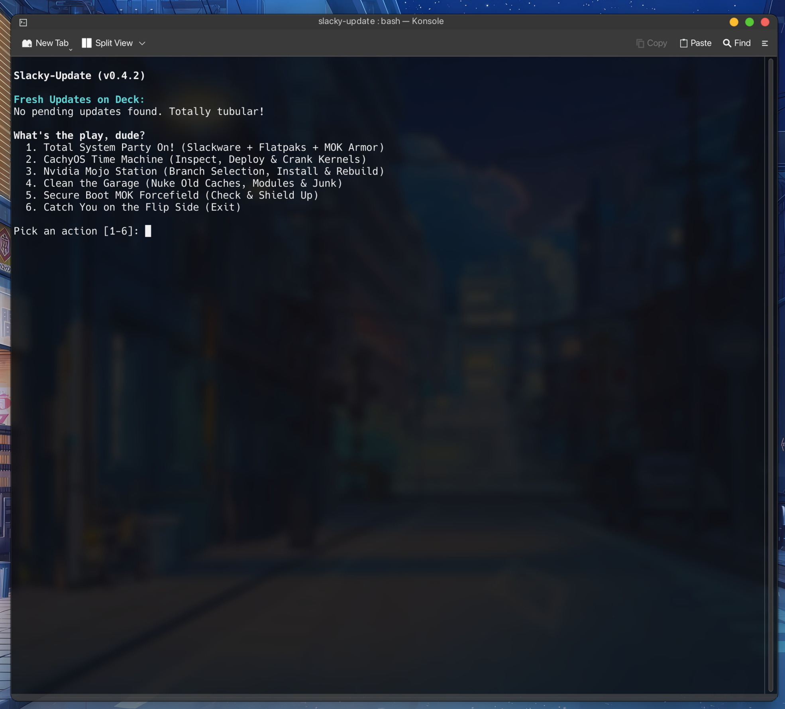

<div align="center">

# ⚡ Slacky-Update
### *Enterprise-Grade System Maintenance, Kernel Lifecycle, Driver Orchestrator & Workstation Suite for Slackware Linux*
#### `v1.0_RC2` — *"Dark Star"* (Stability & Hardware Release Candidate)

[](http://www.slackware.com/)
[](https://github.com/TuxOfValhalla/slacky-update/releases)
[](https://github.com/TuxOfValhalla/slacky-update)
[](https://codeberg.org/TuxOfValhalla/slacky-update)
[](LICENSE)
[](lib/)
[](locales/)
[](docs/THE_ULTIMATE_SLACKY_UPDATE_SURVIVAL_GUIDE.md)
[](docs/OH_MY_HYPRLAND_GUIDE.md)
[](docs/TECHNICAL_COMPANION_GUIDE.md)

---

**Slacky-Update** is an all-in-one system maintenance station, background monitor, driver orchestrator, and gaming/workstation modernization suite engineered specifically for **Slackware Linux (-current / 15.0+)**.

*Canonical source: [GitHub](https://github.com/TuxOfValhalla/slacky-update) | Mirror: [Codeberg](https://codeberg.org/TuxOfValhalla/slacky-update) | Master Guide: [The Ultimate Survival Guide](docs/THE_ULTIMATE_SLACKY_UPDATE_SURVIVAL_GUIDE.md) | Hyprland: [Oh My Hyprland Guide](docs/OH_MY_HYPRLAND_GUIDE.md) | Technical Architecture: [Technical Companion Guide](docs/TECHNICAL_COMPANION_GUIDE.md) | Troubleshooting: [Troubleshooting Guide](docs/TROUBLESHOOTING_GUIDE.md)*

</div>

---

> [!IMPORTANT]
> **TARGET DISTRIBUTION REQUIREMENT & VERSION DISCLAIMER**  
> **Slacky-Update is engineered strictly for Slackware 15+ (`slackware-current` / `Slackware 16 alpha`).**  
> It is **NOT** compatible with or supported on legacy **Slackware 15.0 (stable)**. Legacy 15.0 systems feature older core packages, toolchains, and shared libraries (older glibc, GCC, Wayland/Mesa, PipeWire, and kernel headers) that cause package and soname conflicts which cannot be safely resolved. Users on Slackware 15.0 must migrate to `slackware-current` before using this suite.

> [!CAUTION]
> **COMPREHENSIVE TESTING, LIABILITY & USE-AT-YOUR-OWN-RISK DISCLAIMER**  
> * **Hardware Testing & Verification:** Slacky-Update has been extensively verified and field-tested on the author's bare-metal workstations, and dry-run/simulated test passes have been executed across diverse build environments. However, **this in no way guarantees that it will operate seamlessly or without anomalies on your specific hardware configuration.**
> * **100% User Responsibility:** Slacky-Update executes deep, low-level modifications to foundational system components, including kernel deployments, proprietary graphics stacks, initramfs generation, Btrfs subvolumes, and UEFI bootloader topologies. **All installation, upgrades, and system modifications are performed 100% at your own discretion and risk.**
> * **No Liability for Data Loss:** The authors, maintainers, and contributors assume **no liability, warranty, or responsibility** for system malfunctions, unbootable states, hardware quirks, or loss of personal data.
> * **Mandatory Backups:** Always maintain current, tested backups of your personal data (`/home`, configuration files, and boot partitions) and keep a bootable Slackware Live-USB accessible before performing upgrades or modifying bootloaders.
> * **Bug Reporting & Support:** If you encounter bugs, regressions, or hardware edge-cases, please report them on [GitHub Issues](https://github.com/TuxOfValhalla/slacky-update/issues) so they can be addressed. Beyond the comprehensive documentation provided in `docs/`, no individual customer support, warranties, or service level agreements are offered.

---

## 📸 Screenshots

| 🖥️ Interactive Terminal Command Center | 🔔 System Tray Monitor & Applet |
| :---: | :---: |
|  |  |

---

## 🏛️ System Architecture

Slacky-Update adheres strictly to Slackware's native packaging standards (`/var/log/packages`), BSD-style init scripts (`/etc/rc.d/`), and pure source transparency:

```
┌─────────────────────────────────────────────────────────────────────────────┐
│                           SLACKY-UPDATE ARCHITECTURE                        │
├─────────────────────────────────────────────────────────────────────────────┤
│  [User Layer]      CLI Interface (Bash)  │  System Tray Applet (PyQt5)      │
├─────────────────────────────────────────────────────────────────────────────┤
│  [Desktop Layer]   Hyprland + Noctalia   │  KDE Plasma Wayland  │  XFCE     │
├─────────────────────────────────────────────────────────────────────────────┤
│  [Graphics/Audio]  NVIDIA Master Stack   │  AMD ROCm / HIP  │  PipeWire/DSP │
├─────────────────────────────────────────────────────────────────────────────┤
│  [Kernel Layer]    CachyOS Schedulers    │  Arch Zen/Linux  │  Stock Huge   │
├─────────────────────────────────────────────────────────────────────────────┤
│  [Init/Storage]    Dracut Initramfs      │  Btrfs Snapper Snapshots         │
├─────────────────────────────────────────────────────────────────────────────┤
│  [Boot Layer]      Limine (Two-Zone + sbctl)  │  GRUB / ELILO Coexistence   │
└─────────────────────────────────────────────────────────────────────────────┘
```

---

## 🚀 Key Modules & Capabilities at a Glance

For full architectural breakdowns, step-by-step walkthroughs, and troubleshooting, consult **[The Ultimate Slacky-Update Survival Guide](docs/THE_ULTIMATE_SLACKY_UPDATE_SURVIVAL_GUIDE.md)**.

```
=============================================================================
                      ⚡ SLACKY-UPDATE CONTROL CENTER ⚡
=============================================================================
 [1] Total System Synchronization --> Slackware + Flatpaks + SBo + Kernels
 [2] CachyOS Kernel Time Machine  --> 9 Kernel Schedulers, Deploy & Purge
 [3] NVIDIA & ROCm Graphics Hub   --> CachyOS Master, DKMS, OpenCL / HIP
 [4] Curated & Underpants Gnomes  --> Native Workstation Apps, Games & Drivers
 [5] System Cleanup & Retention   --> Dual Kernel Retention & Artifact Purge
 [6] Limine & Secure Boot Armor   --> Two-Zone Config, CMDLINE Hub, sbctl Signing
 [7] System Performance Tweaks    --> NVIDIA 615+ VRAM Booster, TCP BBR, NTSYNC
 [8] Master Field Guide & Manual  --> Open Documentation & Mobile Export
 [9] Multi-Lingual Engine (i18n)  --> 24 Locales with 100% Key Parity (244 keys)
=============================================================================
```

### 1. 🛡️ System Synchronization & Package Engine
* **10-Worker Parallel Pre-fetch:** Accelerates `.txz` downloads with resume support (`-C -`), cutting download phases by 5–10×.
* **Stream Normalizer:** Real-time VT100/CSI/DEC normalizer in `run_slackpkg()` converts `\r` to `\n`, strips spinner jumps, filters background `wget` logs, and ensures full scrollback retention in Konsole/zsh.
* **Smart `.new` Reconciliation:** Intelligently categorizes and resolves `/etc/*.new` configuration files.

### 2. 🏎️ CachyOS Kernels (And all the flavors)
* **Microarchitecture Targeting:** Auto-detects host CPU features (`x86_64_v4`, `x86_64_v3`, `x86_64_v2`, `znver4`).
* **9 Specialized Schedulers:** Deploys `bore`, `standard`, `lto`, `eevdf`, `bmq`, `rt-bore`, `rc`, `lts`, and handheld `deckify` (strictly for handhelds/Steam Deck, never for desktop PCs/laptops).
* **Multi-Kernel DKMS & Retention:** Automatically builds out-of-tree modules across all installed kernels and safely retains the 2 newest standard kernels plus active running kernel.

### 3. 🎮 NVIDIA & ROCm Graphics Hub
* **Automated Module Orchestration:** Installs precompiled open modules for CachyOS kernels and `nvidia-open-dkms` for Slackware/Arch kernels.
* **Userspace Integration:** Automatically resolves and packages `cachyos-nvidia-utils`, `libnvidia-egl-gbm`, 64-bit Xorg output class configs, and GLX symlinks. (The official `.run` installer remains supported as a custom fallback).
* **AMD ROCm / HIP Creator Toolkit:** Complete compute runtime deployment for DaVinci Resolve Studio with automatic Mesa OpenCL conflict resolution.

### 4. 🥾 Limine Bootloader & UEFI Secure Boot Matrix
* **Two-Zone `limine.conf`:** Preserves custom user styling in Zone A while atomically calculating kernel boot entries and BLAKE2B anti-tamper hashes in Zone B.
* **Interactive CMDLINE Hub:** Instant toggles for NVIDIA DRM modesetting, AMD LACT overclocking, USB autosuspend, watchdog, and ZSWAP compression.
* **Seamless Windows 11 Dual-Booting:** Keeps UEFI Secure Boot permanently **ENABLED** in motherboard BIOS via automated `sbctl` key management and signing.

### 5. 🩲 Underpants Gnomes Sidecar CLI (`gnomes`) — *Experimental*
* **Host-Sovereign Transmutation:** Transmutes upstream Arch and CachyOS packages into native `.txz` packages isolated under `/opt/underpants/pkgs/` without polluting the host Slackware base.
* **Mandatory Runtime Pool:** Run `gnomes runtime install all` before deploying individual standalone packages.

### 6. 🖥️ Curated Hyprland Desktop Suite
* **`hyprland-noctalia`:** Mac-like Wayland desktop with Noctalia Shell (topbar, dock, spotlight launcher, control center), modular Lua configuration (`hyprland.lua` + `modules/*.lua`), and HyprMod GTK4 visual settings.
* **`hyprland-core`:** DIY minimalist compositor for custom setups. Detailed in **[Oh My Hyprland Guide](docs/OH_MY_HYPRLAND_GUIDE.md)**.

### 7. 🌍 Multi-Lingual Engine (24 Locales)
* Full internationalization across 24 languages with 100% key parity (244 keys each), including sober standard editions and radical 90s pop-culture editions (`en-radical`, `nb-radical`).

---

## 📦 Installation & Setup

### ⚡ Quick One-Liner Install & Upgrade (Recommended)
Paste the one-liner for your preferred mirror directly into your terminal. This securely clones to `/tmp`, builds a native Slackware `.txz` package via `slacky-update.SlackBuild`, installs or upgrades it via `upgradepkg`, and cleans up the temporary build directory:

**GitHub:**
```bash
git clone https://github.com/TuxOfValhalla/slacky-update.git /tmp/slacky-update && (cd /tmp/slacky-update/slackbuild && sudo ./slacky-update.SlackBuild && sudo upgradepkg --install-new --reinstall /tmp/slacky-update.txz) && rm -rf /tmp/slacky-update
```

**Codeberg:**
```bash
git clone https://codeberg.org/TuxOfValhalla/slacky-update.git /tmp/slacky-update && (cd /tmp/slacky-update/slackbuild && sudo ./slacky-update.SlackBuild && sudo upgradepkg --install-new --reinstall /tmp/slacky-update.txz) && rm -rf /tmp/slacky-update
```

### 🛠️ Manual Clone & Build
If you prefer maintaining a persistent local clone of the repository:

```bash
# 1. Clone repository (GitHub or Codeberg)
git clone https://github.com/TuxOfValhalla/slacky-update.git
cd slacky-update/slackbuild

# 2. Build the package via SlackBuild
sudo ./slacky-update.SlackBuild

# 3. Install or upgrade
sudo upgradepkg --install-new --reinstall /tmp/slacky-update.txz
```

---

## 💻 CLI Quick Reference

```bash
# Interactive Control Center
slacky-update

# Full unattended system update
slacky-update -y

# Curated Hyprland Desktop Deployment
slacky-update --hyprland
slacky-update --hyprland-noctalia
slacky-update --hyprland-core

# Underpants Gnomes CLI (Experimental Sidecar)
gnomes runtime install all   # Install shared runtime pool
gnomes -S <package>          # Install package
gnomes -Ss <query>           # Search packages
gnomes -Syu                  # Update installed packages
gnomes -R <package>          # Remove package

# Bootloader & Hardware Hubs
slacky-update --limine       # Limine & Secure Boot Matrix
slacky-update --cmdline      # Kernel CMDLINE & Gaming Hub
slacky-update --sync-nvidia  # NVIDIA Driver Stack Synchronization
slacky-update --clean        # Cache & Kernel Cleanup
slacky-update --tweaks       # System Performance & Gaming Tweaks
```

---

## 📖 Complete Documentation & System Manuals

* 📘 **[The Ultimate Slacky-Update Survival Guide](docs/THE_ULTIMATE_SLACKY_UPDATE_SURVIVAL_GUIDE.md)** — Master operational manual, engine architecture, ELI5 breakdowns, and troubleshooting playbooks.
* 🖥️ **[Oh My Hyprland Guide](docs/OH_MY_HYPRLAND_GUIDE.md)** — Deep dive into `hyprland-noctalia` vs `hyprland-core`, modular Lua configs, HyprMod GUI editor, and keybinding references.
* 🛠️ **[Technical Companion Guide](docs/TECHNICAL_COMPANION_GUIDE.md)** — Architectural whitepaper detailing internal engines, sandboxing, and Slackware coexistence philosophy.
* 🚨 **[Disaster Recovery & Troubleshooting Guide](docs/TROUBLESHOOTING_GUIDE.md)** — Recovery playbooks, symptom catalogs, and emergency live-USB chroot procedures.
* 🥾 **[Limine & Secure Boot Field Guide](docs/LIMINE_SECUREBOOT_FIELD_GUIDE.md)** — ESP partitioning standards, topology migration, and `sbctl` setup.
* 🧙 **[Underpants Gnomes Field Guide](docs/UNDERPANTS_GNOMES_FIELD_GUIDE.md)** — Pacman sidecar CLI guide and runtime pool management.

---

## 📜 Project Ancestry, Trademarks & License

### AI-Assisted Development Notice
This suite was architected, debugged, refactored, and validated on bare-metal Slackware hardware by **tuxofvalhalla** with the assistance of advanced AI pair-programming agents.

### Trademarks & Disclaimer
* **Slacky-Update** is an independent open-source project by and for the Linux enthusiast community.
* This project is **not** officially affiliated with, endorsed by, or sponsored by **Patrick Volkerding** or **Slackware Linux, Inc.**
* The name *Slackware* and the *Slackware logo* are registered trademarks of **Patrick Volkerding** and **Slackware Linux, Inc.**, used under **nominative fair use** strictly to identify target system compatibility.

### License
Licensed under the **GNU General Public License v3.0 (GPL-3.0)**. See [LICENSE](LICENSE) for details.
