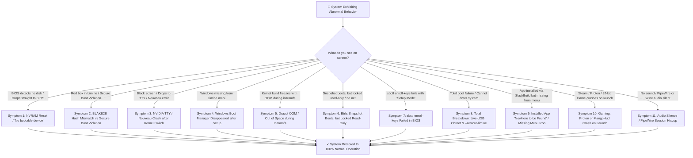
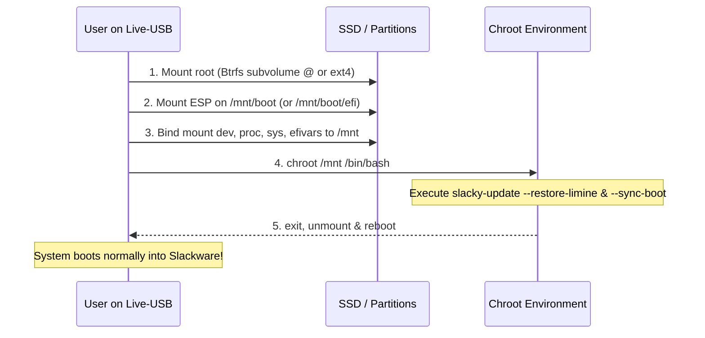

# 🚨 Slacky-Update Disaster Recovery & Troubleshooting Guide
### *The Symptom-Based Field Catalog for Emergency Recovery, Kernel Glitches, NVRAM Resets & Secure Boot Armor*
#### `v0.13.0` — *"It's My Party, And I'll Cry If I Want To..."* (Release Edition)

---

> [!CAUTION]
> **PRE-RELEASE / EARLY ACCESS DISCLAIMER & LIABILITY NOTICE — USE AT YOUR OWN RISK**  
> Slacky-Update v0.12 is an active *Pre-Release / Early Access* edition. The software operates at a low system level with critical infrastructure, including Linux kernels, proprietary NVIDIA drivers, Dracut initramfs, Btrfs subvolumes, and bootloader topologies (Limine/GRUB).  
> **All troubleshooting, emergency recovery procedures, and system modifications are executed strictly at your own discretion and risk.** The developers, maintainers, and contributors assume no liability or warranty for system malfunction, unbootable states, hardware damage, or data loss.  
> **Golden Rule:** Always ensure you have a bootable Slackware Live-USB accessible and maintain current, verified backups of `/home` and configuration files before performing system interventions.

---

> [!NOTE]
> ### 🧩 ELI5 Master Overview — What is this guide and why do you care?
> Think of this guide as the emergency glovebox manual for your tuned custom muscle car. When something unexpected happens on your Slackware system — a screen doesn't turn on, an app is playing hide-and-seek, or the motherboard is acting confused after a BIOS flash — you don't need a 400-page engineering manual on Unix kernel theory. You just want to know **what happened in plain English** and **which 1–2 commands fix it immediately**. Match your symptom below and let's get you back on the highway!

---

## 🧭 Fast Selector: Identify Your Problem



---

## 🛠️ The 11 Critical Failure Scenarios

---

### 1. 🔌 Black Screen / "No bootable device" (NVRAM Cleared after BIOS Update)

> [!TIP]
> #### 🧩 ELI5 (Explain Like I'm 5)
> *Imagine your computer has a tiny sticky note in its brain with Slackware's home address written on it. When you update your motherboard BIOS or change the CMOS battery, someone wiped that sticky note clean. Slackware and all your files are still sitting comfortably inside the house, but the computer needs you to write the address back on the note.*

#### A. Symptom
Following a motherboard UEFI/BIOS update, CMOS battery swap, or firmware reset, the motherboard refuses to boot into Slackware. The screen displays *"No bootable device found"*, *"Reboot and Select proper Boot Device"*, or drops automatically into the UEFI BIOS setup utility.

#### B. Where are you?
* **Position:** UEFI BIOS setup screen or BIOS one-shot boot selector (F8/F11/F12).
* **State:** Your Linux system and files on SSD/NVMe are 100% intact, but the motherboard's NVRAM has cleared its registered list of UEFI boot entries.

#### C. Diagnosis
Boot the system via a Slackware Live-USB or UEFI Shell and inspect NVRAM:
```bash
efibootmgr -v
```
*Expected failure output:* No entries present for `Slackware (Limine)` or `Limine Bootloader`.

#### D. Fix (Recovery Procedure)
1. **Method 1: UEFI Fallback Boot (Automatic)**  
   Slacky-Update always installs Limine to the standard UEFI fallback path: `/EFI/BOOT/BOOTX64.EFI`. Open your BIOS Boot Menu (F11/F12 during power-on) and select the SSD drive directly (e.g., `UEFI OS (Samsung 990 PRO)`).
2. **Method 2: Re-register NVRAM Entry from Live-USB**  
   If fallback boot is not auto-detected by firmware, boot your Slackware Live-USB and run:
   ```bash
   sudo efibootmgr --create --disk /dev/nvme0n1 --part 1 --label "Slackware (Limine)" --loader '\EFI\limine\limine-uefi-x86_64.efi'
   ```
3. **Method 3: Slacky-Update Shortcut**  
   Once booted into your system:
   ```bash
   sudo slacky-update --limine
   ```
   Select the reinstall option to restore and re-register the NVRAM entry cleanly.

#### E. Stop-Line
If `efibootmgr` returns `EFI variables are not supported on this system`, it indicates the Live-USB was booted in Legacy CSM/BIOS mode instead of UEFI. Reboot the Live-USB in **UEFI Native Mode**.

---

### 2. 🔏 BLAKE2B Hash Mismatch vs. Secure Boot Violation

> [!TIP]
> #### 🧩 ELI5 (Explain Like I'm 5)
> *Imagine a security guard guarding the front door with a clipboard containing a photo of your kernel. If you update the kernel or change a boot file without telling the guard, the photo on his clipboard doesn't match your new look (Hash Mismatch). If the guard asks for an ID card with your signature stamp and can't find one, that's a Secure Boot Violation. Running `--sync-boot` prints a new photo and puts your stamp on the card so the guard waves you right through!*

#### A. Symptom
The boot process halts with one of two distinct error dialogs:
* **Error Type A (Limine Safe Hashing):** Limine displays a red warning modal:  
  `Hash mismatch for file /vmlinuz-... (Expected: abc..., Got: def...)`
* **Error Type B (UEFI Secure Boot):** The motherboard firmware halts execution with:  
  `Secure Boot Violation - Invalid Signature Detected`

#### B. Where are you?
* **Position:** Limine boot menu or UEFI firmware warning prior to kernel execution.

#### C. Diagnosis
* **For Error Type A:** A kernel or initrd file was modified outside Slacky-Update (e.g., manual `mkinitrd` or manual file replacement on the ESP), causing the on-disk binary checksum to diverge from the BLAKE2B hash in `limine.conf`.
* **For Error Type B:** A new kernel or driver module lacks a valid digital signature from your local `sbctl` Machine Owner Key (MOK).

#### D. Fix
1. **Bypass Error Type A temporarily in Limine menu:**  
   Press `E` on the selected boot entry in the Limine menu to enter the live editor. Delete the hash string (everything following `#` on `kernel_path` or `module_path`) and press `F10` to boot.
2. **Permanent Resealing and Signing:**  
   Once logged into your desktop/TTY, run Slacky-Update's automated synchronization engine:
   ```bash
   sudo slacky-update --sync-boot
   ```
   This recalculates fresh BLAKE2B cryptographic hashes for all installed kernels and signs all binaries against `sbctl`.

#### E. Stop-Line
Never disable Secure Boot in BIOS to "resolve" a hash mismatch — that is Limine's internal anti-tamper check, not BIOS firmware. Use `--sync-boot` to update the hashes properly.

---

### 3. 🖥️ NVIDIA TTY / Nouveau Fallback Crash after Kernel Switch

> [!TIP]
> #### 🧩 ELI5 (Explain Like I'm 5)
> *Your graphics card and your new Linux kernel need to speak the exact same language. When you switch to a new CachyOS or Slackware kernel, the old graphics driver module is still speaking the old dialect. Because they can't understand each other, your fancy graphical desktop refuses to start and drops you into a text screen. Running `--sync-nvidia` rebuilds the matching driver module in seconds.*

#### A. Symptom
After booting into a newly installed CachyOS or Slackware kernel, the system boots into a plain text console (`tty1`), or the graphical display manager (KDE Plasma / XFCE / Wayland) fails to launch. `dmesg` reports:
`API mismatch: the client has the version 615.71.09, but this kernel module has the version ...`

#### B. Where are you?
* **Position:** TTY text console login prompt.

#### C. Diagnosis
Log in as root or your standard user in TTY and inspect driver state:
```bash
nvidia-smi
lsmod | grep -i nvidia
```
*Expected failure output:* `NVIDIA-SMI has failed because it couldn't communicate with the NVIDIA driver.`

#### D. Fix
1. **Run Slacky-Update NVIDIA Synchronization:**
   ```bash
   sudo slacky-update --sync-nvidia
   ```
   Slacky-Update executes an automated 3-stage operation:
   - Scans all kernel directories and purges conflicting, obsolete `nvidia*.ko*` module remnants.
   - For CachyOS kernels: Installs pre-compiled matching CachyOS open modules with zero build delay.
   - For custom/stock kernels: Executes automated DKMS module rebuilding.
   - Runs `depmod -a` and regenerates Dracut initramfs with early NVIDIA KMS drivers.
2. **Restart Graphical Display Manager:**
   ```bash
   sudo /etc/rc.d/rc.4 restart
   # or reboot:
   sudo reboot
   ```

#### E. Stop-Line
If DKMS fails due to missing kernel header packages, verify that `cachyos-kernel-*-headers` is installed for the active kernel via `slacky-update --check`.

---

### 4. 🪟 Windows Boot Manager Disappeared from Limine (Scenario C Multiboot)

> [!TIP]
> #### 🧩 ELI5 (Explain Like I'm 5)
> *Windows is still relaxing in its own room on your SSD, completely unharmed. When you created a dedicated Slackware EFI partition, Limine was configured for Linux and simply hasn't knocked on Windows' door yet. Running `--limine` scans all your drives and puts the Windows button back on your boot screen.*

#### A. Symptom
Following adoption or creation of a dedicated Slackware ESP partition (Scenario C), Windows 11 no longer appears as a boot option in the Limine menu.

#### B. Where are you?
* **Position:** Limine boot menu.
* **State:** Your Windows installation and Windows Boot Manager on the original Windows ESP partition are 100% intact, but Limine does not know the partition GUID of the secondary drive.

#### C. Diagnosis
Inspect connected storage block devices to locate the Windows EFI bootloader:
```bash
lsblk -f
sudo blkid | grep -i vfat
```

#### D. Fix
1. **Run Limine Dual-Boot Auto-Discovery:**
   ```bash
   sudo slacky-update --limine
   ```
   Slacky-Update scans all connected storage drives for `EFI/Microsoft/Boot/bootmgfw.efi` and generates a dedicated chainload entry in Zone B:
   ```ini
   /Windows 11 Boot Manager
       protocol: efi_chainload
       image_path: guid(xxxxxxxx-xxxx-xxxx-xxxx-xxxxxxxxxxxx):/EFI/Microsoft/Boot/bootmgfw.efi
   ```
2. **Firmware Direct Boot:**  
   You can always tap F11/F12 during power-on to boot Windows directly from the motherboard BIOS menu.

#### E. Stop-Line
Never format or delete existing ESP partitions on secondary drives — Windows Boot Manager and BitLocker keys depend on that partition structure.

---

### 5. 🧠 Dracut Out of Memory (OOM) during Initramfs Generation

> [!TIP]
> #### 🧩 ELI5 (Explain Like I'm 5)
> *Dracut tried to build a giant Lego castle while sitting inside a tiny cupboard (`/tmp` in RAM). Because the castle had huge NVIDIA graphics pieces, it ran out of floor space and threw an error. Telling Dracut to build the castle on the big living room rug (`/var/tmp` on your SSD) gives it all the room in the world.*

#### A. Symptom
During kernel upgrades, `dracut` or `slackpkg` crashes with:
`dracut: Out of memory / zstd: write error: No space left on device` or system freezes entirely during compression.

#### B. Where are you?
* **Position:** Slacky-Update or terminal during package upgrade execution.

#### C. Diagnosis
Inspect available RAM and disk space on `/tmp`:
```bash
free -h
df -h /tmp /boot
```
*Root Cause:* Upstream Dracut attempts to build initramfs inside a small RAM-backed `tmpfs` in `/tmp` while compressing large NVIDIA kernel drivers.

#### D. Fix
1. **Slacky-Update Staging Shield (Automatic):**  
   Slacky-Update forces Dracut and `mkinitrd` to stage builds in `/var/tmp` on physical SSD storage (`TMPDIR=/var/tmp`).
2. **Manual Safe Rebuild:**
   ```bash
   sudo TMPDIR=/var/tmp dracut --force --kver $(uname -r) /boot/initramfs-$(uname -r).img
   sudo slacky-update --sync-boot
   ```

#### E. Stop-Line
If `/boot` is genuinely 100% full (`df -h /boot` reports 0 free bytes), execute `sudo slacky-update --clean` to remove obsolete kernels before generating new initramfs images.

---

### 6. 📸 Btrfs Snapshot Boots, but Remains Locked Read-Only

> [!TIP]
> #### 🧩 ELI5 (Explain Like I'm 5)
> *When you select an old snapshot from the boot menu, you are in 'Museum Visitor Mode' — you can look around and verify everything works, but you can't write on the walls (read-only). If you like what you see and want to live in that version permanently, you tell Snapper `rollback` to make it your new official home.*

#### A. Symptom
You selected an earlier Btrfs Snapper snapshot from the Limine menu following an unsuccessful configuration change. The system boots, but applications fail with `Read-only file system` errors, or desktop daemons fail to start.

#### B. Where are you?
* **Position:** Running system inside a read-only Btrfs snapshot (`/.snapshots/<id>/snapshot`).

#### C. Diagnosis
Verify the root filesystem mount options:
```bash
findmnt /
```
*Expected output:* `TARGET: /  SOURCE: /dev/...[/@snapshots/42/snapshot]  OPTIONS: ro,...`

#### D. Fix (How to Permanently Roll Back)
Booted snapshots are deliberately set to *read-only* to preserve historical state integrity. To make this snapshot your permanent, writable active system:
1. **Execute Snapper Rollback:**
   ```bash
   sudo snapper rollback
   ```
2. **Reboot the Machine:**
   ```bash
   sudo reboot
   ```
3. Upon reboot, the snapshot is cloned into your primary default subvolume (`@`) in full read/write mode, and Limine menus are refreshed automatically.

#### E. Stop-Line
Never attempt to remount a read-only snapshot with `mount -o remount,rw /` — this disrupts Btrfs snapshot tree consistency. Always use `snapper rollback`.

---

### 7. 🔑 `sbctl enroll-keys` Failed in BIOS (Setup Mode Not Active)

> [!TIP]
> #### 🧩 ELI5 (Explain Like I'm 5)
> *Your motherboard came with a factory padlock locked by Microsoft. To let your custom keys open the lock, you have to go into BIOS setup, switch the padlock to 'Setup Mode' (which opens the padlock so it can learn new keys), and then run `sbctl enroll-keys`.*

#### A. Symptom
Running `sbctl enroll-keys` fails with:
`Error: Secure Boot is not in Setup Mode` or `Permission Denied writing to KEK/PK`.

#### B. Where are you?
* **Position:** Slackware terminal or Slacky-Update Secure Boot Armor menu.

#### C. Diagnosis
Check Secure Boot status via `sbctl`:
```bash
sudo sbctl status
```
*Output:* `Setup Mode: Disabled ✗` and `Secure Boot: Enabled ✓` (locked with factory Microsoft keys).

#### D. Fix (Step-by-Step BIOS Setup)
1. Reboot the PC and enter the UEFI BIOS setup utility (Del / F2 during power-on).
2. Navigate to **Security** $\rightarrow$ **Secure Boot**.
3. Locate **Key Management** (or *Secure Boot Mode*).
4. Select **"Clear Secure Boot Keys"** or change Secure Boot Mode from *Standard* to **"Custom" / "Setup Mode"**.  
   *(This temporarily clears factory keys and places the motherboard in learning mode).*
5. Save settings and boot back into Slackware.
6. Re-run key enrollment:
   ```bash
   sudo sbctl enroll-keys --microsoft
   sudo slacky-update --sync-boot
   ```
   *Flag note:* `--microsoft` guarantees Microsoft UEFI CA keys are enrolled, allowing Windows 11 and third-party GPU option ROMs to boot seamlessly.

#### E. Stop-Line
If the motherboard requires an administrator BIOS password to modify Secure Boot keys, configure a temporary password in BIOS before clearing keys.

---

### 8. 🚑 Total System Failure: Live-USB Chroot & `--restore-limine`

> [!TIP]
> #### 🧩 ELI5 (Explain Like I'm 5)
> *If the front door to your house is completely broken and nothing will boot, you boot from a rescue USB stick. You then open a direct service tunnel (`chroot`) straight into your SSD and tell Slacky-Update to rebuild the front door (`--restore-limine` and `--sync-boot`).*

#### A. Symptom
The computer cannot boot into Slackware at all (kernel panic, missing initramfs, corrupted bootloader, or power loss mid-transaction).

#### B. Where are you?
* **Position:** Outside the installed system. You must boot a **Slackware Live-USB**.

#### C. Diagnosis
Boot from the Slackware Live-USB and identify your drive partitions:
```bash
lsblk -o NAME,SIZE,FSTYPE,MOUNTPOINTS
```

#### D. Fix (Universal 5-Step Chroot Rescue Procedure)



#### Step 1: Mount Filesystems
* **For Btrfs systems (default `@` subvolume):**
  ```bash
  sudo mount -o subvol=@ /dev/nvme0n1p2 /mnt
  sudo mount /dev/nvme0n1p1 /mnt/boot
  ```
* **For standard ext4 systems:**
  ```bash
  sudo mount /dev/nvme0n1p2 /mnt
  sudo mount /dev/nvme0n1p1 /mnt/boot
  ```

#### Step 2: Bind System Virtual Directories
```bash
for d in dev dev/pts proc sys sys/firmware/efi/efivars; do
    sudo mount --bind /$d /mnt/$d
done
```

#### Step 3: Enter Chroot Environment
```bash
sudo chroot /mnt /bin/bash
source /etc/profile
```

#### Step 4: Run Slacky-Update Emergency Restore
Inside the chroot, you have full access to Slacky-Update's automated recovery suite:
```bash
# Restore Limine bootloader from verified backup
slacky-update --restore-limine

# Re-synchronize kernels, Dracut initramfs, and Secure Boot signatures
slacky-update --sync-boot
```

#### Step 5: Clean Exit & Reboot
```bash
exit
sudo umount -R /mnt
sudo reboot
```

#### E. Stop-Line
If `mount` fails due to filesystem damage after unexpected power loss, run `btrfs check --repair` (for Btrfs) or `fsck.ext4 -y` (for ext4) on the root partition *before* attempting to mount.

---

### 9. 📦 Installed App / SlackBuild "Nowhere to be Found" (Missing Menu Icon or Broken Symlink)

> [!TIP]
> #### 🧩 ELI5 (Explain Like I'm 5)
> *The delivery truck brought your new app and put it in the garage (`/usr/lib64/`), but nobody put a signpost in your hallway (`/usr/bin/`) or a button on your desktop menu. If an app doesn't appear after installing a package, 99% of the time it's because the desktop icon cache hasn't refreshed or the command link in `/usr/bin` was pointing to the wrong spot.*

#### A. Symptom
You successfully built and installed an application (such as Opera, DaVinci Resolve, or FreeOffice) via a SlackBuild or `installpkg`, but typing the app name in terminal returns `command not found`, and searching for the app in KDE Plasma or XFCE application menus yields no results.

#### B. Where are you?
* **Position:** Running Slackware graphical desktop (KDE / XFCE).

#### C. Diagnosis
1. Check if the binary exists in `/usr/lib64` or `/opt`:
   ```bash
   ls -la /usr/lib64/opera-stable/opera /opt/*/bin/* 2>/dev/null
   ```
2. Check if `/usr/bin/<app>` is a dangling symlink:
   ```bash
   ls -la /usr/bin/opera /usr/bin/freeoffice* 2>/dev/null
   ```
3. Check if the desktop file exists:
   ```bash
   ls -la /usr/share/applications/*.desktop | grep -i <appname>
   ```

#### D. Fix
1. **Fix Launcher Symlink in `/usr/bin`:**
   ```bash
   # Example for Opera:
   sudo ln -sf /usr/lib64/opera-stable/opera /usr/bin/opera
   sudo ln -sf /usr/lib64/opera-stable/opera /usr/bin/opera-stable
   ```
2. **Refresh Desktop & Icon Databases:**
   ```bash
   sudo update-desktop-database /usr/share/applications
   sudo gtk-update-icon-cache -f -t /usr/share/icons/hicolor
   sudo update-mime-database /usr/share/mime
   ```
3. **Launch directly from Terminal:**
   ```bash
   /usr/bin/opera &
   ```

#### E. Stop-Line
If the app opens but crashes immediately with missing shared libraries, run `ldd /path/to/binary | grep "not found"` to identify missing dependencies.

---

### 10. 🎮 Gaming, Steam, Proton, or MangoHud Crash on Launch

> [!TIP]
> #### 🧩 ELI5 (Explain Like I'm 5)
> *Most Windows games are 32-bit programs running on your 64-bit Linux machine. To run them, your system needs 32-bit translation libraries (multilib). If a game closes the second you click Play, or MangoHud doesn't show up, running `slacky-update --multilib` checks every single 32-bit bridge and fixes broken links automatically.*

#### A. Symptom
Steam launches, but games crash immediately upon starting, Proton displays a black window, or MangoHud HUD overlays fail to render in Vulkan games.

#### B. Where are you?
* **Position:** Desktop user session playing games through Steam, Heroic, or Lutris.

#### C. Diagnosis
1. Verify 32-bit Multilib compatibility:
   ```bash
   /usr/bin/32/gcc -v 2>/dev/null || echo "Multilib incomplete"
   ```
2. Check Vulkan driver visibility:
   ```bash
   vulkaninfo --summary
   ```

#### D. Fix
1. **Run Slacky-Update Multilib Auto-Heal:**
   ```bash
   sudo slacky-update --multilib
   ```
2. **Test Game with MangoHud in Terminal:**
   ```bash
   MANGOHUD=1 vkcube
   # Or in Steam Launch Options:
   # mangohud %command%
   ```

#### E. Stop-Line
If using an NVIDIA GPU, ensure the 32-bit NVIDIA compatibility libraries (`nvidia-kernel-32bit` / `lib32-nvidia-utils`) match your primary host driver version.

---

### 11. 🔊 Sound / Audio Silence or Wine Bridge Glitches

> [!TIP]
> #### 🧩 ELI5 (Explain Like I'm 5)
> *Your audio wires (PipeWire and WirePlumber) got unplugged or tangled during a long computer session. Restarting your personal sound server plugs the audio cables right back in without needing to reboot your PC.*

#### A. Symptom
Suddenly no sound output in browser, DAW, or games, or PipeWire reports `Connection refused` when starting a media player.

#### B. Where are you?
* **Position:** Desktop user session (no root required).

#### C. Diagnosis
Check PipeWire user daemons:
```bash
wpctl status
pactl info
```

#### D. Fix (User Session Reset — No sudo needed)
1. **Restart PipeWire & WirePlumber User Daemons:**
   ```bash
   killall -9 pipewire pipewire-pulse wireplumber 2>/dev/null || true
   # Daemons will automatically restart via XDG autostart or run:
   pipewire &
   wireplumber &
   pipewire-pulse &
   ```
2. **Verify Default Audio Sink:**
   ```bash
   wpctl status
   # Set default sink if muted:
   wpctl set-volume @DEFAULT_AUDIO_SINK@ 100%
   wpctl set-mute @DEFAULT_AUDIO_SINK@ 0
   ```

#### E. Stop-Line
Do NOT run `pipewire` or `pulseaudio` as root with `sudo` — audio servers must run exclusively under your standard user account.

---

## 📞 Summary of Emergency Commands

| Objective | Slacky-Update CLI Command |
| :--- | :--- |
| **Restore Bootloader & Safe Hashes** | `sudo slacky-update --sync-boot` |
| **Restore Limine from Known-Good Backup** | `sudo slacky-update --restore-limine` |
| **Repair NVIDIA & DKMS after Crash** | `sudo slacky-update --sync-nvidia` |
| **Repair 32-bit Multilib for Gaming** | `sudo slacky-update --multilib` |
| **Purge Old Kernels when Disk is Full** | `sudo slacky-update --clean` |
| **Configure Secure Boot & sbctl** | `sudo slacky-update --limine` |
| **Check System Health (Read-Only)** | `slacky-update --check` |

---

*Manual Canonical Source: [GitHub](https://github.com/TuxOfValhalla/slacky-update) | Secondary Mirror: [Codeberg](https://codeberg.org/TuxOfValhalla/slacky-update)*

